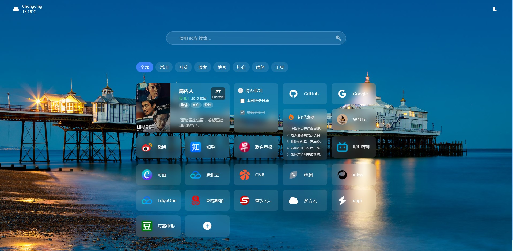
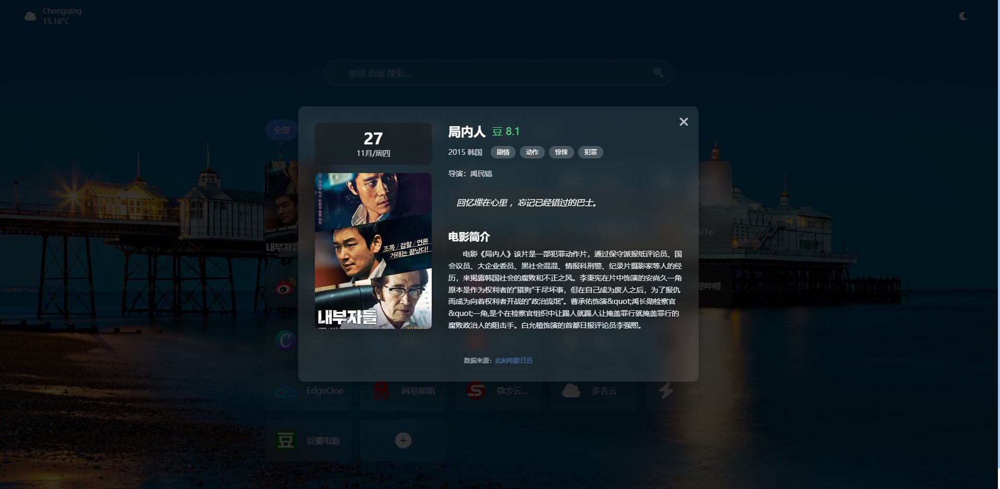

# SimpleNav

由于其它的导航页多少有些使用上的不便，要么功能缺失，要么功能丰富但卡顿等等。

所以我借助 AI 写了一个基于 Next.js 构建的个人导航页面，具有美观的界面和较丰富的自定义功能。

## 界面预览







## 功能特点

- 🎨 **美观的界面设计**：支持多种背景类型（纯色、图片、渐变、Bing每日一图、本地上传）
- 🌅 **自动更新壁纸**：支持自动获取并更新Bing每日一图作为背景
- 🔍 **集成搜索功能**：目前只支持必应，暂时没有能力把搜索引擎图标放到搜索框左侧用于点击切换
- 📱 **响应式设计**：适配各种设备屏幕
- 🗂️ **分类管理**：支持链接分类和筛选
- 🌙 **主题切换**：支持明暗主题切换
- ☁️ **云同步**：支持OneDrive云同步功能
- 📤 **数据导入导出**：支持 json 格式的数据的备份和恢复
- 🖼️ **图标选择**：支持Font Awesome图标或网站favicon
- 🔥 **小组件集成**：目前支持知乎热榜、电影日历和待办事项
- 📌 **卡片拖动排序**：支持所有卡片的自由拖动排序
- ⚙  **组件管理**：支持开关电影日历、待办事项、知乎热榜等小组件的开关。

## 技术栈

- **前端框架**：Next.js 14
- **UI库**：Tailwind CSS
- **图标**：Font Awesome
- **语言**：TypeScript
- **数据存储**：LocalStorage / OneDrive


## 快速开始

### 安装依赖

```bash
npm install
```

### 运行开发服务器

```bash
npm run dev
```

在浏览器中打开 [http://localhost:3000](http://localhost:3000) 查看效果。

### 构建生产版本

```bash
npm run build
npm start
```

## 使用说明

### 基本使用

1. **添加链接**：点击页面中的"+"按钮，填写链接信息
2. **编辑链接**：右键点击可以编辑或删除链接
3. **分类筛选**：点击顶部的分类标签进行筛选
4. **搜索功能**：使用搜索框进行网络搜索
5. **设置页面**：点击页脚的"设置"按钮登陆 onedrive 以同步、设置网页背景和数据导入导出
6. **卡片位置**：长按卡片可以拖动调整位置
7. **待办事项**：点击待办事项卡片可以添加、编辑和删除待办事项
8. **知乎热榜**：点击知乎热榜卡片可以查看详细的热榜内容
9. **主题切换**：在右上角可以切换明/暗主题
10. **背景设置**：在设置中可以设置背景类型、图片和渐变效果

## 项目结构

**以下内容有待优化完善**

```
src/
├── app/                 # Next.js App Router
│   ├── api/            # API路由
│   │   ├── auth/       # 认证相关API
│   │   │   ├── callback/ # 回调路由
│   │   │   ├── login/   # 登录路由
│   │   │   ├── logout/  # 登出路由
│   │   │   └── status/  # 状态路由
│   │   ├── bing-image/ # Bing图片API
│   │   ├── debug/      # 调试API
│   │   ├── onedrive/   # OneDrive API
│   │   │   ├── links/   # 链接相关API
│   │   │   └── settings/ # 设置相关API
│   │   └── zhihu-hot/  # 知乎热榜API
│   ├── favicon.ico     # 网站图标
│   ├── globals.css     # 全局样式
│   ├── layout.tsx      # 根布局
│   └── page.tsx        # 主页面
├── components/         # React 组件
│   ├── AboutDialog.tsx    # 关于对话框
│   ├── Clock.tsx          # 时钟组件
│   ├── DataManagement.tsx # 数据管理组件
│   ├── Footer.tsx         # 页脚组件
│   ├── Header.tsx         # 头部组件
│   ├── HelpDialog.tsx     # 帮助对话框
│   ├── LinkForm.tsx       # 链接表单组件
│   ├── LinksGrid.tsx      # 链接网格组件
│   ├── MovieCalendar.tsx  # 电影日历组件
│   ├── OneDriveAuth.tsx   # OneDrive认证组件
│   ├── Search.tsx         # 搜索组件
│   ├── StorageSettings.tsx # 存储设置组件
│   ├── TodoDialog.tsx     # 待办事项对话框
│   ├── UnifiedSettings.tsx # 统一设置面板组件
│   ├── Weather.tsx        # 天气组件
│   └── ZhihuHotBoardDialog.tsx # 知乎热榜对话框
├── lib/                # 工具函数
│   ├── auth.ts # OneDrive认证
│   ├── onedrive.ts # OneDrive操作
│   ├── onedrive-storage.ts # OneDrive存储操作
│   ├── storage.ts          # 本地存储操作
│   └── utils.ts            # 通用工具函数
└── types/              # TypeScript 类型定义
    └── index.ts        # 类型定义
```

## 部署

详细的部署指南请参考 [DEPLOYMENT.md](./DEPLOYMENT.md)。

### 环境变量

项目需要以下环境变量：

```bash
# Azure OAuth 配置
AZURE_CLIENT_ID=your_azure_client_id
AZURE_CLIENT_SECRET=your_azure_client_secret
AZURE_TENANT_ID=your_azure_tenant_id
AZURE_REDIRECT_URI=http://localhost:3000/api/auth/callback  # 开发环境

# JWT 密钥
JWT_SECRET=your_jwt_secret_key

# 心知天气API配置
NEXT_PUBLIC_SENIVERSE_API_KEY=your_seniverse_api_key
```

## 贡献

感谢 [upapi](https://uapis.cn/) 提供的知乎热榜 API，

感谢[此刻电影](https://www.cikeee.com/) 提供的电影日历 API，

感谢 [bing.img.run](https://bing.img.run/) 提供的 Bing 图片 API，

感谢[Favicon.im](https://favicon.im/) 提供的 Favicon API。

欢迎提交 Issue 和 Pull Request！

## 许可证

MIT License